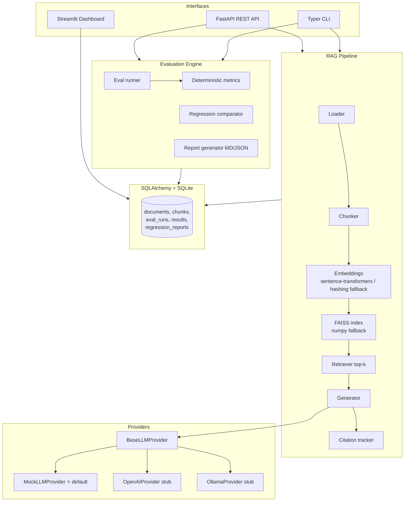

# LLMOpsForge

**An LLM evaluation and monitoring platform for RAG applications.**

LLMOpsForge benchmarks a Retrieval-Augmented Generation (RAG) app across the
dimensions that actually matter in production: **answer correctness, citation
grounding, hallucination / unsupported-claim rate, JSON schema validity,
retrieval relevance, latency, estimated cost, and prompt/model regression.**

It runs **fully locally with zero paid API calls** using a deterministic
`MockLLMProvider`. Optional OpenAI and Ollama providers are available but never
required.

> Think of it as a miniature, self-contained version of the eval + observability
> stack you'd build around a production RAG system (à la RAGAS / Promptfoo /
> Langfuse) — but transparent, dependency-light, and reproducible.

---

## Why LLM evaluation matters

Shipping a RAG app without evals is shipping blind. A prompt tweak that "looks
better" can quietly:

- **drop answer correctness** on edge cases,
- **introduce hallucinations** (claims not supported by retrieved context),
- **break JSON output** that a downstream system depends on,
- **regress retrieval** so the right document stops being found,
- or **balloon cost/latency** for a marginal quality gain.

LLMOpsForge turns "looks better" into a **measured, versioned, regression-gated**
decision: run the dataset, compare candidate vs baseline, and get a verdict —
**safe to ship / investigate / blocked**.

---

## Architecture



See [`ARCHITECTURE.md`](ARCHITECTURE.md) for a component-by-component breakdown.

---

## Setup

Requires **Python 3.11+**.

```bash
# 1. Create and activate a virtual environment
python -m venv .venv
source .venv/bin/activate        # Windows: .venv\Scripts\activate

# 2. Install (core + dev tooling)
pip install -e ".[dev]"

# 3. (Optional) real vector stack + dashboard + OpenAI
pip install -e ".[dev,vectors,dashboard,openai]"
```

> **Zero-config by default.** Without the `vectors` extra, embeddings use a
> deterministic hashing embedder and retrieval uses an exact numpy cosine index —
> so everything runs offline with no model downloads. Install `vectors` to use
> real `sentence-transformers` embeddings + FAISS.

Copy the env template if you want to tweak anything (nothing is required):

```bash
cp .env.example .env
```

---

## Quickstart (CLI)

```bash
# Ingest the bundled sample corpus
llmopsforge ingest --docs-path documents/

# Ask a question
llmopsforge query "What is the refund period?"

# Run the evaluation suite (26 Q&A over the corpus)
llmopsforge eval --dataset datasets/qa_eval.jsonl --config configs/default.yaml

# Compare two runs for regressions
llmopsforge regression --baseline-run-id <BASE_ID> --candidate-run-id <CAND_ID>

# Generate a Markdown report
llmopsforge report --eval-run-id <RUN_ID> --format markdown --output report.md

# Launch the dashboard
llmopsforge dashboard
```

Compare prompt **v1** vs **v2** to see a real regression signal:

```bash
# Baseline with prompt_v1 (default config)
llmopsforge eval --config configs/default.yaml --name baseline

# Candidate with prompt_v2 (edit configs/default.yaml: prompt_template_id: prompt_v2)
#   prompt_v2 enforces grounding, always cites, and emits strict JSON.
llmopsforge eval --config configs/prompt_v2_eval.yaml --name candidate
llmopsforge regression --baseline-run-id <BASE> --candidate-run-id <CAND>
```

---

## API

```bash
make run-api          # uvicorn app.main:app --reload --port 8000
# open http://localhost:8000/docs for interactive Swagger UI
```

| Method | Endpoint | Description |
| --- | --- | --- |
| `GET`  | `/health` | Service + corpus status |
| `POST` | `/documents/ingest` | Ingest a file or directory |
| `POST` | `/rag/query` | Run a single RAG query |
| `POST` | `/evals/run` | Run an evaluation over a dataset |
| `GET`  | `/evals/{eval_run_id}` | Fetch a run + per-task results |
| `GET`  | `/evals/{eval_run_id}/report` | Markdown report for a run |
| `POST` | `/evals/regression` | Compare a candidate run to a baseline |
| `GET`  | `/metrics/summary` | Aggregate metrics across runs |

Example:

```bash
curl -X POST localhost:8000/documents/ingest \
  -H 'content-type: application/json' \
  -d '{"docs_path": "documents/"}'

curl -X POST localhost:8000/rag/query \
  -H 'content-type: application/json' \
  -d '{
        "question": "What is the refund period?",
        "top_k": 4,
        "prompt_template_id": "prompt_v2",
        "model_config_id": "mock-small",
        "require_citations": true
      }'
```

Response (abridged):

```json
{
  "answer": "Customers may request a full refund within 30 days of the original purchase date.",
  "citations": [{"chunk_id": "refund_policy.md::chunk_1", "document_name": "refund_policy.md", "score": 0.83}],
  "retrieved_contexts": [{"chunk_id": "refund_policy.md::chunk_1", "document_name": "refund_policy.md", "text": "..."}],
  "latency_ms": 1.4,
  "estimated_tokens": 220,
  "estimated_cost": 0.0,
  "model_name": "mock-small",
  "prompt_template_id": "prompt_v2"
}
```

---

## Dashboard

```bash
make dashboard        # streamlit run dashboard/streamlit_app.py
```

Five pages: **Evaluation Summary**, **Failed Examples**, **Prompt/Model
Comparison**, **Regression Report**, **Retrieval Inspection**.

> 📸 _Dashboard screenshots placeholder — add `docs/img/dashboard_*.png` here._

---

## Sample evaluation report

```markdown
# Evaluation Report — `a1b2c3d4...`

## Summary Metrics
| Metric | Value |
| --- | --- |
| Pass rate | 0.9231 |
| Answer correctness (avg) | 0.95 |
| Citation correctness (avg) | 1.00 |
| Grounding (avg) | 0.98 |
| Retrieval relevance (avg) | 1.00 |
| Hallucination count | 0 |
| JSON validity rate | 1.00 |
| Avg latency (ms) | 1.6 |
| Total cost (USD) | 0.0 |

## Recommendations
- Pass rate is healthy (≥90%).
- All examples passed; consider expanding the dataset with harder cases.
```

(Full example produced by `llmopsforge report`.)

---

## Real RAG with a real LLM (OpenRouter)

By default the system uses a deterministic, zero-cost mock. To run **real** RAG,
plug in [OpenRouter](https://openrouter.ai) — one key, many models (GPT, Claude,
Llama, Gemini) including **free** ones:

```bash
pip install -e ".[openrouter]"          # installs the OpenAI SDK
echo "OPENROUTER_API_KEY=sk-or-..." >> .env   # get a key at openrouter.ai/keys

llmopsforge ingest --docs-path documents/
# answer with a real (free) model:
llmopsforge query "How is customer data encrypted at rest?" --model openrouter-free
# evaluate a real model over the dataset:
llmopsforge eval --config configs/default.yaml --model openrouter-free
# add an LLM judge too:
llmopsforge eval --model openrouter-free --judge-model openrouter-free
```

Model ids live in `configs/model_configs.yaml`: `openrouter-free`,
`openrouter-gpt-4o-mini`, `openrouter-claude`. Set `model_config_id` in an eval
config to evaluate that model.

## Assessing an EXTERNAL RAG (any pipeline, incl. ones from GitHub)

The eval engine isn't limited to the built-in RAG. Anything that returns
`answer` + `retrieved_contexts` (+ optional `citations`) can be graded by the
same metrics, regression, reports, and dashboard.

**Over HTTP** — expose the target RAG behind an endpoint that accepts
`POST {"question": "..."}` and returns `{"answer": "...", "retrieved_contexts": [...]}`:

```bash
llmopsforge assess --rag-url http://localhost:9000/answer \
  --dataset datasets/qa_eval.jsonl \
  --judge-model openrouter-free       # optional LLM-as-judge
```

**In Python** — wrap any callable (LangChain/LlamaIndex chain, etc.):

```python
from app.evals.adapters import FunctionRagAdapter
from app.evals.runner import EvalRunner
from app.evals.judge import build_judge
from app.config import load_eval_config
from app.storage.database import session_scope, init_db

def my_rag(question: str) -> dict:
    # call your pipeline; return answer + the contexts it retrieved
    return {"answer": "...", "retrieved_contexts": [{"document_name": "x.md", "text": "..."}]}

init_db()
with session_scope() as s:
    run = EvalRunner(
        s,
        pipeline=FunctionRagAdapter(my_rag),
        judge=build_judge("openrouter-free"),   # optional
    ).run(dataset_path="datasets/qa_eval.jsonl", config=load_eval_config("configs/default.yaml"))
    print(run.summary)
```

> **Two requirements to assess an external RAG well:** (1) an adapter that returns
> its answer + retrieved contexts (above), and (2) a **labelled dataset** with
> expected answers/sources for the docs it indexes. Without labels, use
> `--judge-model` so an LLM grades faithfulness/correctness instead.

## LLM-as-judge

Deterministic metrics need labels; an optional LLM judge (`app/evals/judge.py`)
scores **correctness / faithfulness / relevancy** with any model. It never
changes the deterministic pass/fail — it's an additive `judge_overall_avg`
signal, ideal when grading unlabelled corpora. See [`EVALS.md`](EVALS.md).

## Project layout

```
app/
  api/         FastAPI routes + Pydantic schemas
  rag/         loader, chunker, embeddings, retriever, generator, citations, pipeline
  providers/   base + mock (default) + openai/ollama stubs + factory
  evals/       metrics, runner, regression, reports
  storage/     SQLAlchemy database, models, repository
  cli.py       Typer CLI
  config.py    settings + YAML loaders
dashboard/     Streamlit app
datasets/      qa_eval.jsonl (26 tasks)
documents/     sample corpus (5 Markdown docs)
configs/       default.yaml, prompt_v1/v2.yaml, model_configs.yaml
tests/         pytest suite (unit + API + CLI + e2e)
```

---

## Development

```bash
make test             # pytest
make lint             # ruff check + format --check
make fmt              # ruff format + autofix
make docker-build     # build the API image
docker compose up     # API on :8000, dashboard on :8501
```

---

## Resume bullets

- Built **LLMOpsForge**, a production-style LLM evaluation & monitoring platform
  for RAG apps (FastAPI, SQLAlchemy, FAISS, Streamlit, Typer) with **8 metrics**
  including grounding, hallucination detection, and citation correctness.
- Designed a **provider abstraction** with a deterministic mock so the full
  eval/RAG pipeline runs **offline with zero API cost**, enabling CI-gated evals.
- Implemented **prompt/model regression testing** that compares candidate vs
  baseline runs and emits a **safe-to-ship / investigate / blocked** verdict with
  newly-failed, fixed, and critical-hallucination-regression breakdowns.
- Engineered **graceful degradation**: sentence-transformers→hashing embedder and
  FAISS→numpy fallbacks keep the system runnable on any machine.
- Achieved comprehensive coverage with a **pytest suite** spanning unit, API,
  CLI, and an end-to-end ingest→eval→report→regression test.

---

## Further reading

- [`ARCHITECTURE.md`](ARCHITECTURE.md) — system design
- [`EVALS.md`](EVALS.md) — how each metric is computed (and its limits)
- [`REGRESSION_TESTING.md`](REGRESSION_TESTING.md) — the regression workflow
- [`DESIGN_TRADEOFFS.md`](DESIGN_TRADEOFFS.md) — why the key decisions were made

## License

MIT.
